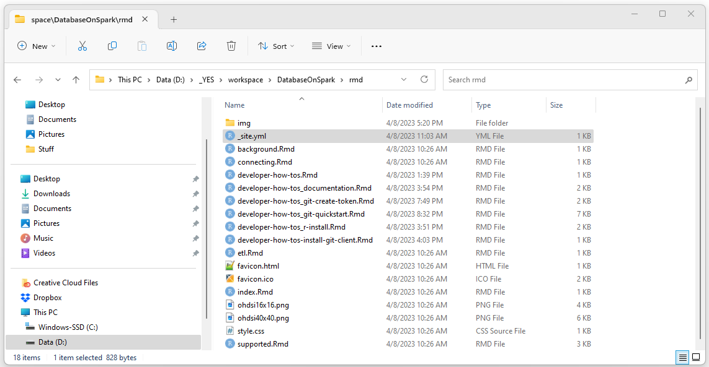
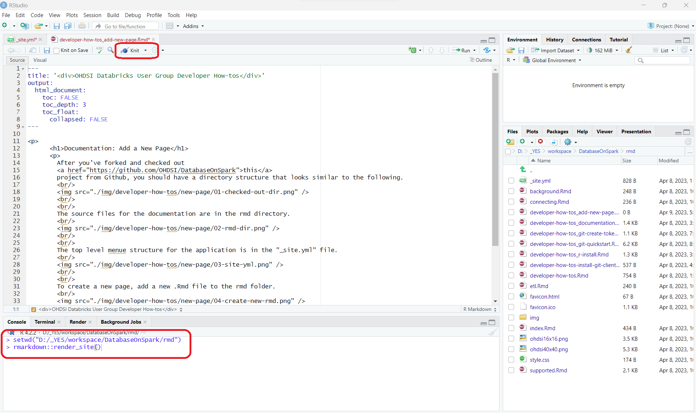
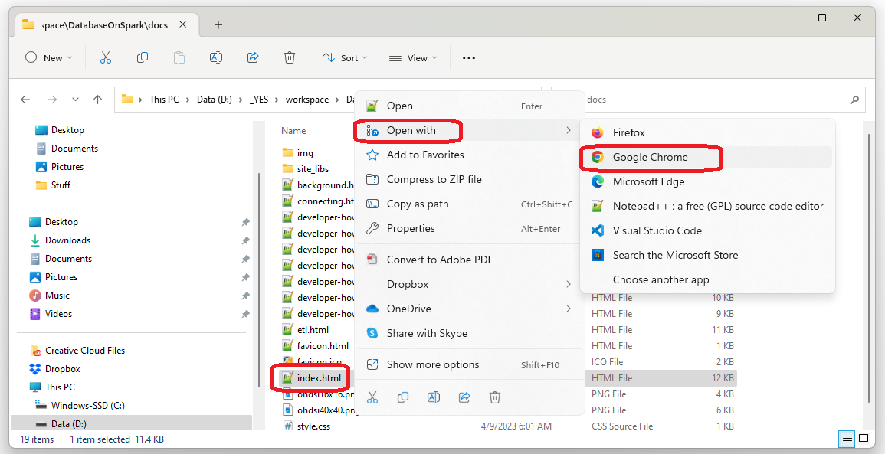

			<h1>Documentation: Add a New Page</h1>
      

        After you've forked and checked out 
        <a href="https://github.com/OHDSI/DatabaseOnSpark">this</a>
        project from Github, you should have a directory structure that looks similar to the following. 
         
        
         
         
        The source files for the documentation are in the rmd directory. 
         
        
         
         
        The top level menue structure for the application is in the "_site.yml" file. 
         
        
         
         
        To create a new page, add a new .Rmd file to the rmd folder. 
         
        
         
         
        Add content to the page using R-markdown and HTML. 
        To preview a page, press the "Knit" button at the top of the RStudio UI. 
        The entire web site can be build by setting the working directory 
        and then running rmarkdown::render_site(). 
         
        
         
         
        After rmarkdown::render_site() has been run, the site can be browsed 
        by opening one of the html files in the ./docs folder using a web browser. 
        
         
         
        When you're done with your edits run rmarkdown::render_site(), commit your work, and create a pull request 
        (see the <a href="./developer-how-tos_git-quickstart.html">Git Quickstart Guide</a> 
        for instructions on committing and creating a pull request). 
      

			

