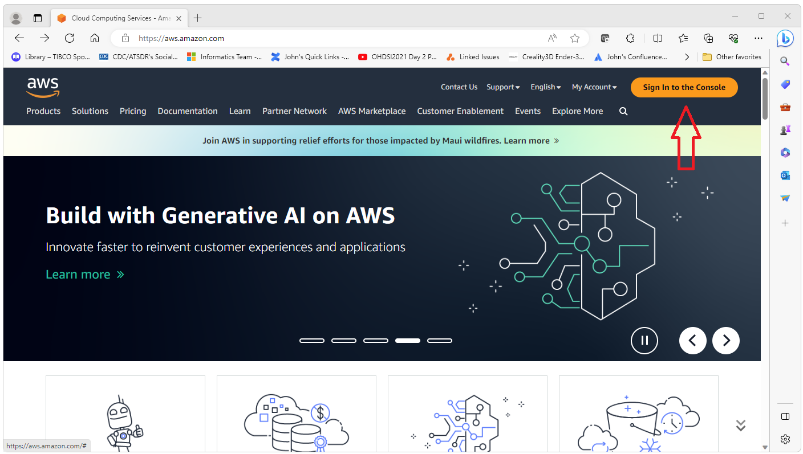
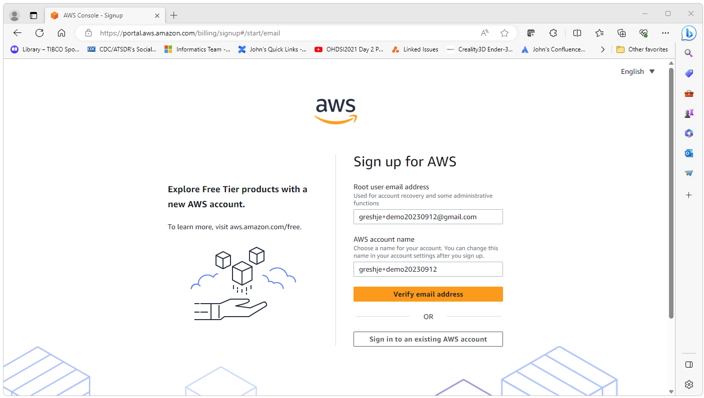
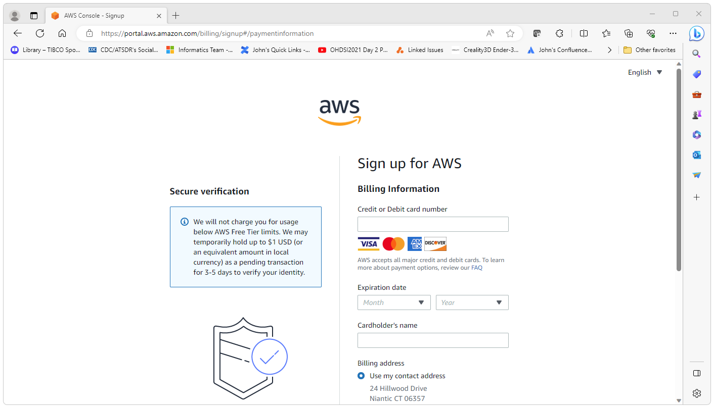
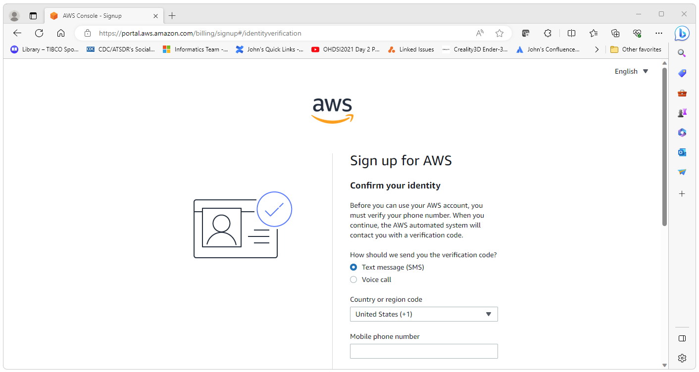
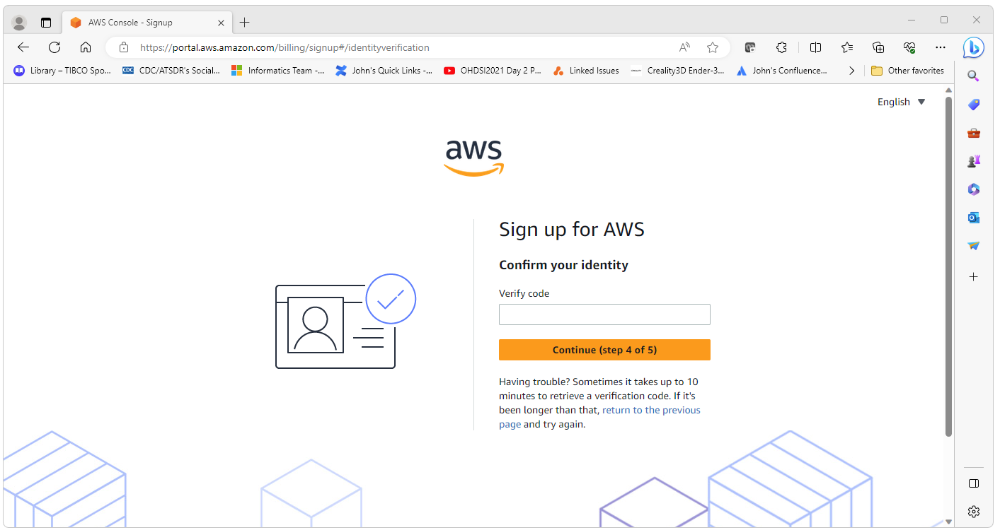
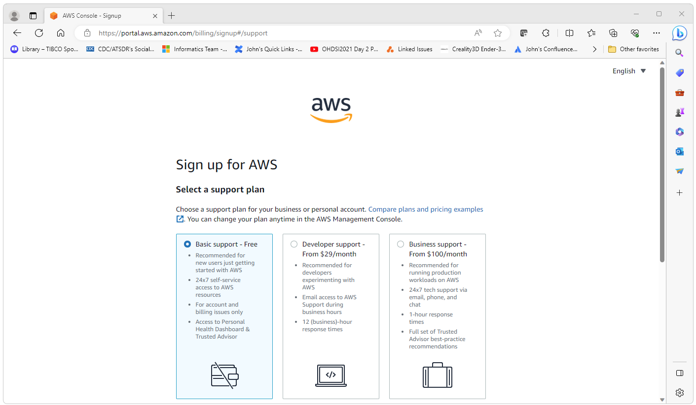
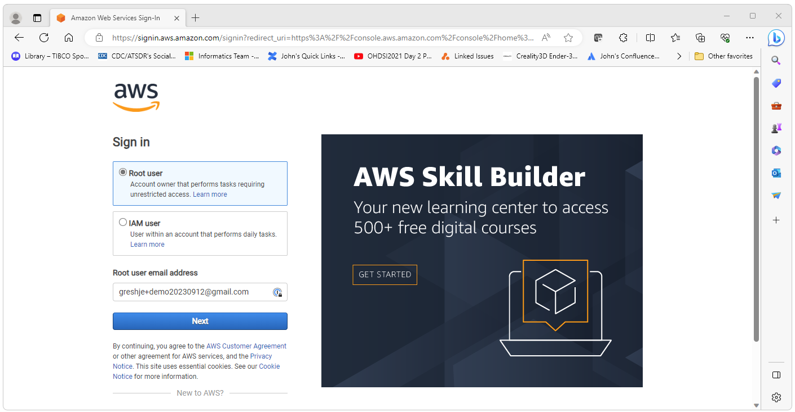

  <h2>Create an AWS Account</h2>
  

    This guide will walk you through the process of creating an Amazon Web Services (AWS) account 
    that can be used to create a test instance of Databricks. 
    You will need a credit card to create the account and the card will be charged 
    if you do not close the account before the end of the trial period. 
  

  <!-- 01-aws-open -->
  

    Navigate to <a href="https://aws.amazon.com">https://aws.amazon.com</a> 
    and select Sign in to the Console. 
     
    
     
     
  

  <!-- 02-create-new -->
  

    On this page select Create New AWS Account. 
     
    
     
     
  

  <!-- 03-sign-up -->
  

    This will take you to the Sign-up page. Enter the information as shown below. 
    You will need a credit card to create the account and the card will be charged 
    if you do not close the account before the end of the trial period. 
     
    
     
     
  

  <!-- SIGN UP -->
  

    This will take you to the series of pages below that are used to create your account. 
     
    <!-- pwd -->
    Create a password. 
     
    
     
     
    <!-- personal-info -->
    Enter password. 
     
    
     
     
    <!-- credit-card  -->
    Enter your credit card information. 
     
    
     
     
    <!-- confirm-identity  -->
    Enter the information required to confirm your identity. 
     
    
     
     
    <!-- confirm-identity-02  -->
    Confirm your identity. 
     
    
     
     
    <!-- select plan  -->
    Select the free plan option (or other if you are setting up a production instance). 
     
    
     
     
    <!-- done  -->
    Your AWS has now been created.  
     
    
     
     
    <!-- log on  -->
    You can now log into your instance using the credentials you created. 
     
    
     
     
    <!-- success  -->
    A successful login should look similar to what is shown below. 
     
    
     
     
  

