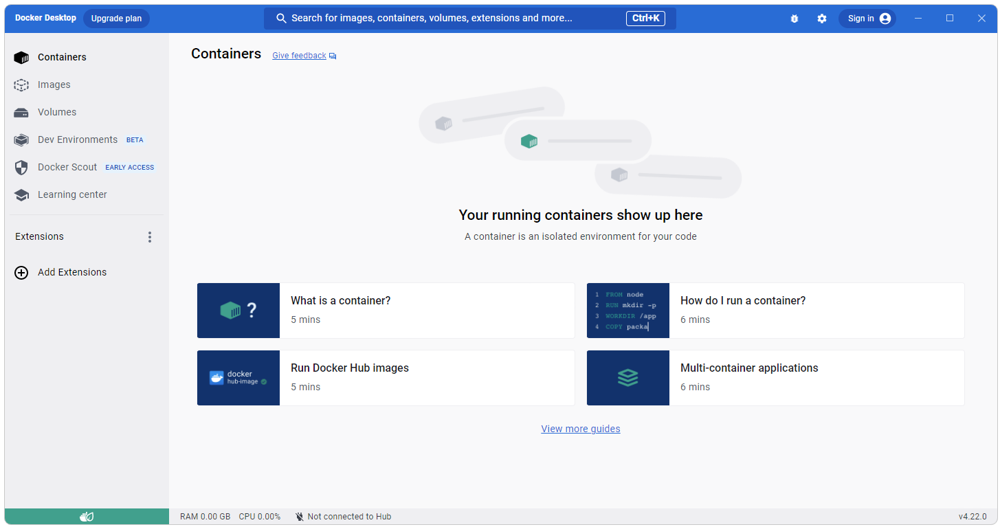
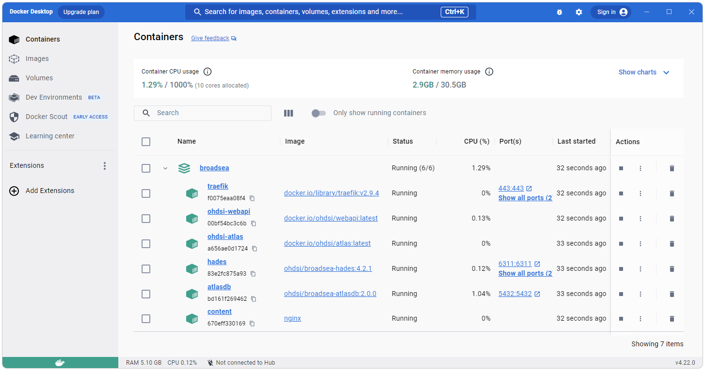

  <!-- * * *
  *
  * INTRODUCTION
  *
  * * * -->
  <h2>Introduction</h2>
  This guide will walk through the creation of a new OHDSI stack using 
  <a href="https://github.com/OHDSI/Broadsea">Broadsea</a> and using Databricks for the CDM on Windows. 
  This guide assumes that you have Docker installed and a CDM instance you can point to in Databricks. 
   
  <h2>Getting Started</h2>
  <h3>Install Ponos</h3>
  

  Ponos is a java application that can be used to automate certian tasks associated with setting up a new OHDSI instance in databricks 
  including tasks such as creating an instance of the Eunomia CDM test data set in Databricks 
  and connecting an existing instance of the CDM in Databricks to OHDSI tools.  
  

  Ponos can be downloaded directly from Github at 
  <a href="https://github.com/NACHC-CAD/ponos">https://github.com/NACHC-CAD/ponos</a>. 
  After downloading the zip file, unzip and update the ./auth/bs-databricks-public-demo.properties to use your specific configuration. 
  More detailed instructions on downloading and installing Ponos are available on the 
  <a href="./developer-how-tos_ohdsi-on-databricks_ponos-install.html">Ponos Install</a> page. 
  <h3>Optional: Install Eunomia CDM</h3>
  

  If you do not have an existing OHDSI CDM in Databricks you would like to use, you can install the Enomia CDM to use as a test case. 
  

  

    To create a test instance of the CDM in Databricks, 
    <a href="./developer-how-tos_ohdsi-on-databricks_ponos-install.html">Download and Install Ponos</a> 
    and the run the following: 
<pre class="pre-scrollable">
run-ponos.bat db-demo
</pre>
    The code that creates the demo_cdm in Databricks can be found in the fhir-to-omop 
    <a href="https://github.com/NACHC-CAD/fhir-to-omop/blob/main/src/main/java/org/nachc/tools/fhirtoomop/tools/databricks/BuildDemoCdmInDatabricks.java">BuildDemoCdmInDatabricks</a> class. 
    The demo_cdm from the Broadsea distribution is created in Databricks using the Ponos tool. 
    Data are sourced from .csv files included in the Ponos project that were created as a extract from a  PostgreSql instance of the demo_cdm. 
    This install includes the following: 
    <ul>
      <li>
        Upload of .csv files for the CDM to the Databricks FileStore
      </li>
      <li>
        Creation of the CDM database in Databricks using the DDL files from the 
        <a ref="https://github.com/OHDSI/CommonDataModel">Common Data Model (CDM)</a> (version 5.3 is used). 
      </li>
      <li>
        Population of the CDM (including vocabulary tables) from the uploaded .csv files
      </li>
    </ul>
  

  <h3>Shutdown PostgreSql</h3>
  Before you get started, make sure you do not have a local instance of PostgreSql running as a service. 
   
  
   
   
  <h3>Start Docker</h3>
  If you do not have Docker Desktop you can download and install it from 
  <a href="https://www.docker.com/products/docker-desktop/">https://www.docker.com/products/docker-desktop/</a>. 
  Start Docker Desktop from either the short cut if it was installed 
  or from the Windows search menu. 
   
   
  <h3>Clean Docker</h3>
  To get started, it's not a bad idea to clear out your Docker instance. 
  The two scripts below can be run from PowerShell. 
  The first script will delete all volumes, containers, and images from your Docker instance. 
  The second script will show you if there are any volumes, containers, or images remaining in your Docker instance.
   
  <a href="img/developer-how-tos/broadsea/scripts/clean-docker.sh">clean-docker.sh</a>
   
  <a href="img/developer-how-tos/broadsea/scripts/show-docker.bat">show-docker.bat</a>
   
   
  The clean script will launch a bash window and ask for comfimation that you really want to delete everything. 
   
  
   
   
  The show script can be used to confirm there's nothing left on Docker. 
   
  
   
   
  <h3>Confirm Docker is Running</h3>
  After Docker has been started and cleaned you should see something like what is shown below in Docker Desktop. 
   
  
  <!-- * * *
  *
  * CLONE FROM GITHUB
  *
  * * * -->
  <h2>Clone Broadsea from Github</h2>
  Clone Broadsea using: 
   
  <pre class="prescrollable">git clone https://github.com/OHDSI/Broadsea</pre>

  <!-- * * *
  *
  * UPDATE BROADSEA
  *
  * * * -->
  <h2>Update Broadsea</h2>
  Next, copy the Spark JDBC Jar File and Update the docker-compose.yml file: 
   
  Paste a copy of the spark JDBC driver you are using into your Broadsea directory 
  (the directory that has the docker-compose.yml file)
  Replace the existing docker-compose.yml file with this 
  <a download href="img/developer-how-tos/broadsea/scripts/docker-compose.yml">docker-compose.yml</a> file. 
  (I usually backup the original as shown below). 
  This new docker-compose.yml file simply adds the following lines to the ohdsi-webapi-from-image section.
<pre class="prescrollable">
    volumes:
      - ./SparkJDBC42.jar:/var/lib/ohdsi/webapi/WEB-INF/lib/SparkJDBC42.jar
</pre>
   
  The Spark JDBC driver and new docker-compose.yml file should now be in the root directory of the Broadsea project as shown below. 
   
  

  <!-- * * *
  *
  * START BROADSEA
  *
  * * * -->
  <h2>Start Broadsea</h2>
  Start Broadsea in the ususal way. 
  Open a cmd prompt, navigate to the Broadsea directory and execute 
<pre class="pre-scrollable">
docker compose pull && docker-compose --profile default up -d
</pre>
  
  <h3>Confirm Broadsea</h3>
  When Broadsea is running you should see something like what is shown below in the Docker Desktop application. 
   
   
  
  
  <!-- * * *
  *
  * CONNECT TO OHDSI
  *
  * * * -->
  <h2>Connect to OHDSI</h2>
  The next step is to connect Your Databricks CDM to OHDSI. This can be done using Ponos bs-init. 
  Instructions for downloading and installing Ponos can be found on the 
  <a href="./developer-how-tos_ohdsi-on-databricks_ponos-install.html">Ponos Install</a> page. 

  <!-- * * *
  *
  * CONFIGURE PARAMETERS
  *
  * * * -->
  <h3>Configure Parametes</h3>
  After downloading and installing Ponos, edit the file found as ./auth/bs-databricks-public-demo.properties to use your parameters. 
  
    
  Use the following cmd from the location where you installed Ponos to connect your Databricks CDM to OHDSI. 
<pre class="pre-scrollable">
run-ponos.bat bs-init
</pre>
  The source for this process is in fhir-to-omop tool suite 
  <a href="https://github.com/NACHC-CAD/fhir-to-omop/blob/main/src/main/java/org/nachc/tools/fhirtoomop/tools/databricks/OhdsiEnableExistingBroadseaOnDatabricksCdm.java">OhdsiEnableExistingBroadseaOnDatabricksCdm</a> class. 
   
  This process will do the following:
  <ul>
    <li>
      Create the Achilles results database in Databricks
    </li>
    <li>
      Create the Achilles tables in Databricks
    </li>
    <li>
      Create the achilles_analysis table from the AchillesAnalysisDetails.csv file
    </li>
    <li>
      Run Achilles to populate the Achilles results tables
    </li>
    <li>
      Create the appropriate source and source_daimon records in the PostgreSql instance of webapi included with Broadsea 
      (existing records for the key in the properties file will be overwritten). 
    </li>
  </ul>

  <!-- 
  * 
  * CONFIGURE SSL 
  *
  * -->
  <h3>Configure SSL and URL</h3>
  The next step is to configure the JDBC URL (UseNativeQuery) and SSL for Databricks:
   
  Most Databricks instances use SSL by default. 
  A Databricks instance that uses SSL will have "ssl=1;" as a parameter in the JDBC URL. 
  To enable a connection that uses SSL, follow the instructions in the 
  <a href="./developer-how-tos_ohdsi-on-databricks-url.html">Notes on the Databricks JDBC URL, SSL, and UseNativeQuery</a> page. 
   
  It should also be noted that the parameter "UseNativeQuery=1;" needs to be added to the url that is inserted into the webapi.source table. 
  If you are using the Ponos application to create your OHDSI on Databricks instance, the Ponos application will add this to the URL if it is not already there. 
  This is also described in the 
  <a href="./developer-how-tos_ohdsi-on-databricks-url.html">Notes on the Databricks JDBC URL, SSL, and UseNativeQuery</a> page. 

  <!-- 
  * 
  * RESTART DOCKER AND LAUNCH ATLAS
  *
  * -->
  <h3>Restart Docker and Launch Atlas</h3>
  Restart Docker:
<pre class="prescrollable">
docker compose --profile default down 
docker compose pull && docker-compose --profile default up -d
</pre> 
   
  Open <a href="http://127.0.0.1/atlas">http://127.0.0.1/atlas</a> in a browser and navigate to Data Sources. 
  Select your data source (in this case "Databricks Demo" and then select a report, the Person report is shown in the screen shot below). 
  When you do this you should not see any errors in the Docker output for webapi as shown below. 
   
  
   
   
  

