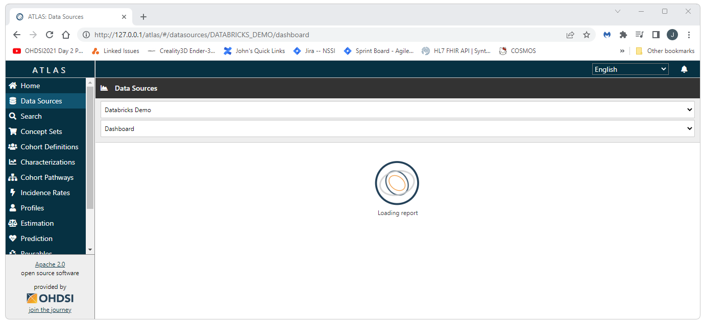

			<h1>Implementing OHDSI on Databricks Using Broadsea</h1>
      

        This is a DRAFT work in progress. 
         
         
        This guide will walk through the creation of a new OHDSI stack using 
        <a href="https://github.com/OHDSI/Broadsea">Broadsea</a> and using Databricks for the CDM on Windows. 
        This guide assumes that you have Docker installed and a CDM instance you can point to in Databricks. 
         
        <h3>Getting Started</h3>
        Before you get started, make sure you do not have a local instance of PostgreSql running as a service. 
         
        
         
         
        To get started, it's not a bad idea to clear out your Docker instance. 
        The two scripts below can be run from PowerShell. 
        The first script will delete all volumes, containers, and images from your Docker instance. 
        The second script will show you if there are any volumes, containers, or images remaining in your Docker instance.
         
        <a href="img/developer-how-tos/broadsea/scripts/clean-docker.sh">clean-docker.sh</a>
         
        <a href="img/developer-how-tos/broadsea/scripts/show-docker.bat">show-docker.bat</a>
         
         
        The clean script will launch a bash window and ask for comfimation that you really want to delete everything. 
         
        
         
         
        The show script can be used to confirm there's nothing left on Docker. 
         
        
        <h3>Clone Broadsea</h3>
        Clone Broadsea using: 
         
        <pre class="prescrollable">git clone https://github.com/OHDSI/Broadsea</pre>
        <h3>Copy the Spark JDBC Jar File and Update the docker-compose.yml file</h3>
        Paste a copy of the spark JDBC driver you are using into your Broadsea directory 
        (the directory that has the docker-compose.yml file)
        Replace the existing docker-compose.yml file with this 
        <a download href="img/developer-how-tos/broadsea/scripts/docker-compose.yml">docker-compose.yml</a> file. 
        (I usually backup the original as shown below). 
        This new docker-compose.yml file simply adds the following lines to the ohdsi-webapi-from-image section.
<pre class="prescrollable">
    volumes:
      - ./SparkJDBC42.jar:/var/lib/ohdsi/webapi/WEB-INF/lib/SparkJDBC42.jar
</pre>
         
        The Spark JDBC driver and new docker-compose.yml file should now be in the root directory of the Broadsea project as shown below. 
         
        
        <h3>Start Broadsea and Update webapi source and source_daimon Records</h3>
        Start Broadsea in the ususal way. 
        Open a cmd prompt, navigate to the Broadsea directory and execute 
<pre class="prescrollable">
docker compose pull && docker-compose --profile default up -d
</pre>    
        Launch pgAdmin, create a server that points to 127.0.0.1 (this is the instance of PostgreSql running in the Docker container). 
        Open a Query Tool window and execute sql similar to the following to create your source and source_daimon records. 
<pre class="prescrollable">
set search_path = webapi, "$user", public;

--
-- insert a source record
-- 

INSERT INTO webapi.source (
	source_id, 
	source_name, 
	source_key, 
	source_connection, 
	source_dialect,
	is_cache_enabled
) 
SELECT 
	2, 
	'Databricks Demo', 
	'DATABRICKS_DEMO', 'jdbc:spark://dbc-e50d1713-1617.cloud.databricks.com:443/default;transportMode=http;ssl=0;httpPath=sql/protocolv1/o/8143606694705459/0423-153323-uwnabn2j;AuthMech=3;UID=token;PWD=dapi9_REDACTED_MIDDLE_OF_THE_TOKEN_0aa2c1', 
	'spark',
	true
;

select * from source;

select * from webapi.source_daimon;

--
-- insert three source_daimon records (use the source id from the above query)
-- 

INSERT INTO webapi.source_daimon (source_daimon_id, source_id, daimon_type, table_qualifier, priority) 
SELECT nextval('webapi.source_daimon_sequence'), 2, 0, 'demo_cdm', 0
;

INSERT INTO webapi.source_daimon (source_daimon_id, source_id, daimon_type, table_qualifier, priority) 
SELECT nextval('webapi.source_daimon_sequence'), 2, 1, 'demo_cdm', 10
;

INSERT INTO webapi.source_daimon (source_daimon_id, source_id, daimon_type, table_qualifier, priority) 
SELECT nextval('webapi.source_daimon_sequence'), 2, 2, 'demo_cdm_results', 0
;
</pre>
        <h3>Note on SSL</h3>
        The default configuration of Broadsea does not include resources for SSL. 
        The JDBC connection string provided by Databricks has SSL enabled by including "ssl=1;" in the URL. 
        This can be resolved by changing the ssl setting to "ssl=0;". 
        <h3>Restart Docker and Launch Atlas</h3>
        Restart Docker:
<pre class="prescrollable">
docker compose --profile default down 
docker compose pull && docker-compose --profile default up -d
</pre> 
         
        Open <a href="http://127.0.0.1/atlas">http://127.0.0.1/atlas</a> in a browser and navigate to Data Sources. 
        Select your data source (in this case "Databricks Demo" and then select a report). 
        If you have not run Achilles, the application will simply show the "Loading report" screen as shown below. 
        When you do this you should not see any errors in the Docker output for webapi as shown below. 
         
        
         
         
        
      

