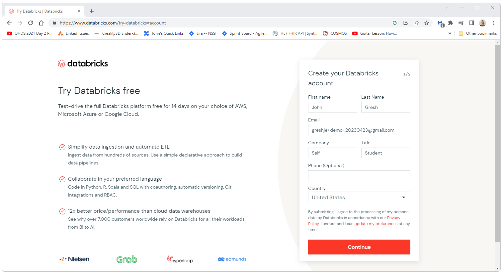
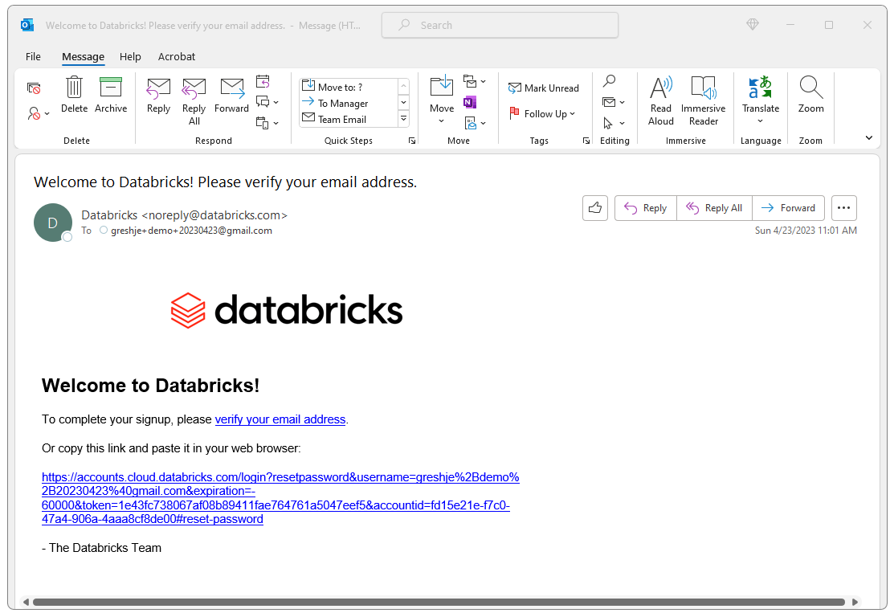

  <h1>Documentation: Create a New Databricks Instance</h1>
  Databricks provides a 14 day trial version of Databricks. 
  This free version will require a host such as AWS, Azure, or Google Cloud. 
  This documentation uses AWS but should be vaild for the most part for Azure and Google Cloud. 
  This document will walk you through the steps to create a new free 14 day trial version of Databricks. 
    
  
  To get started creating your new Databricks instance go to 
  <a href="https://www.databricks.com/try-databricks">
    https://www.databricks.com/try-databricks
  </a> and follow the steps presented there. 
  These steps are detailed below.
    
  
  
    
  For this demo, we will be using Amazon.  Select Amazon as the provider in this step.
   
  

    
  After this initial registration, you should get an email.  Click on the link in the email to continue the registration process.
   
  
    
  

