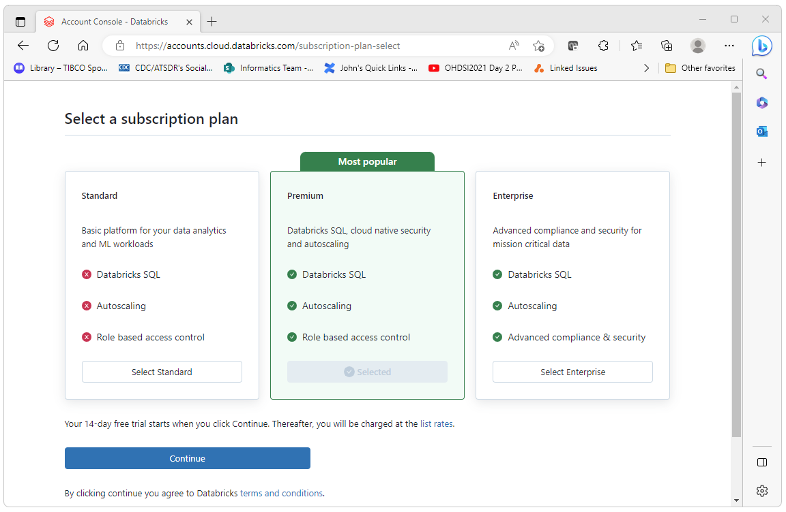
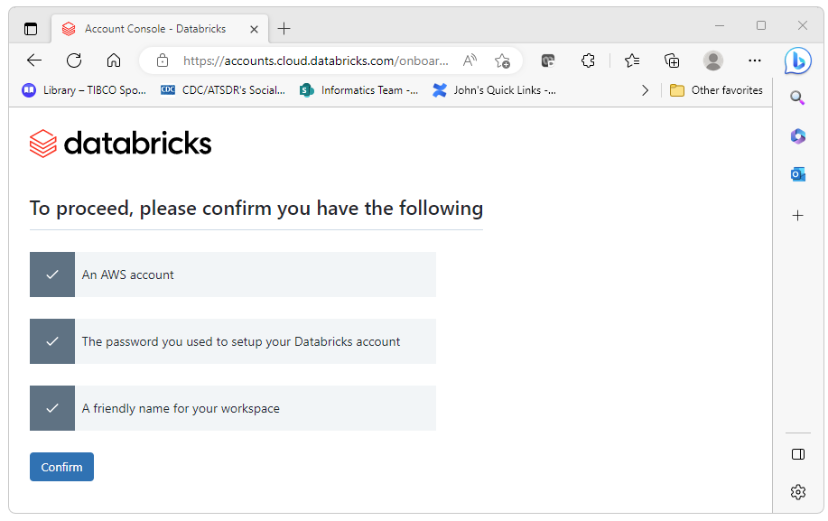
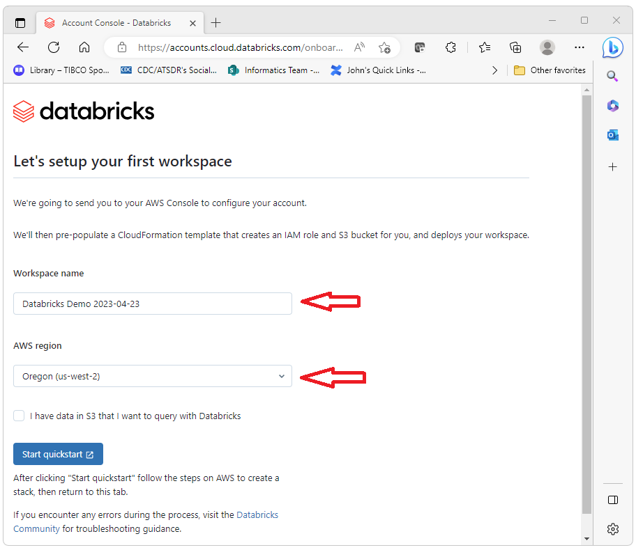
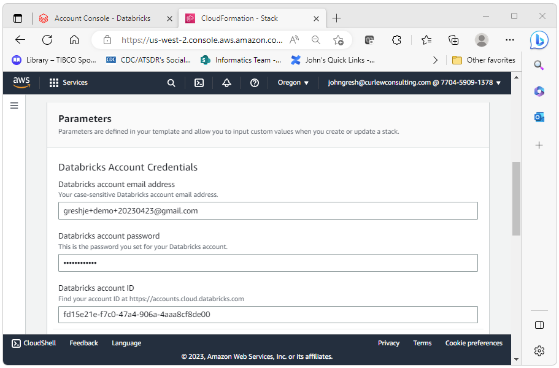
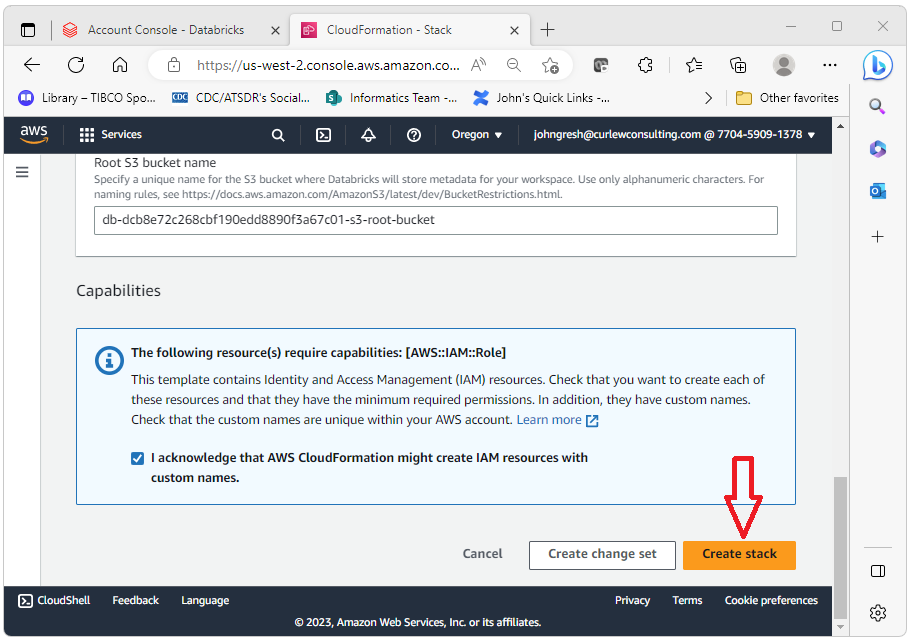
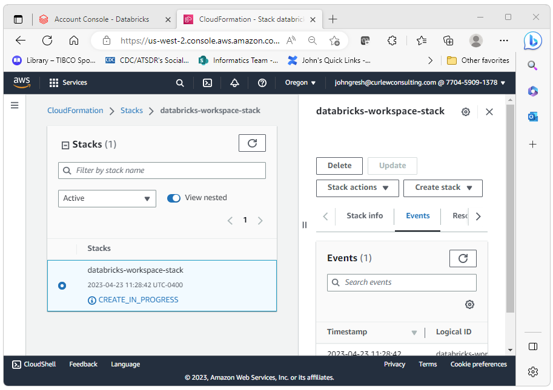
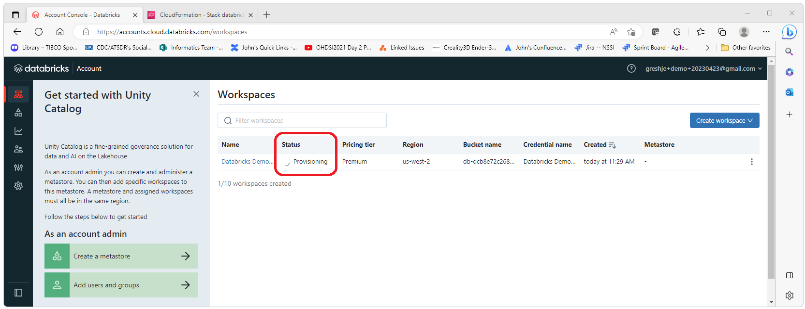
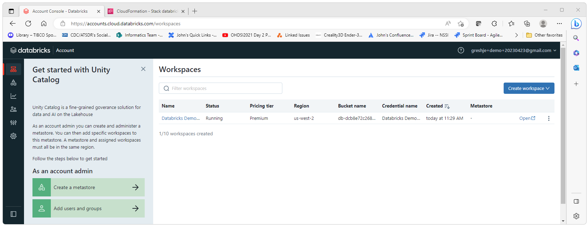
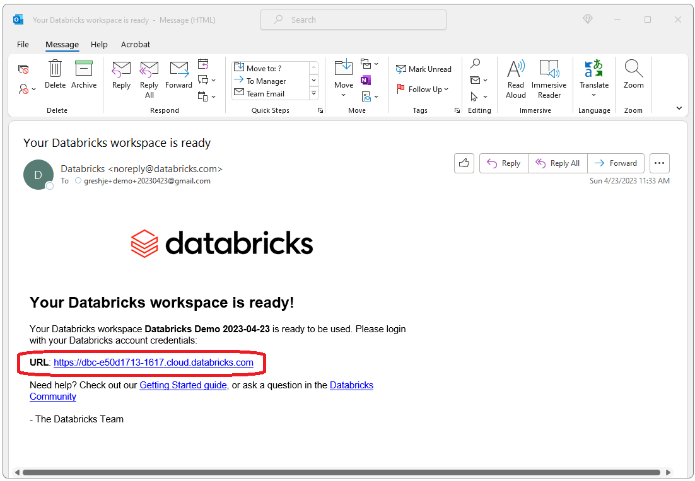
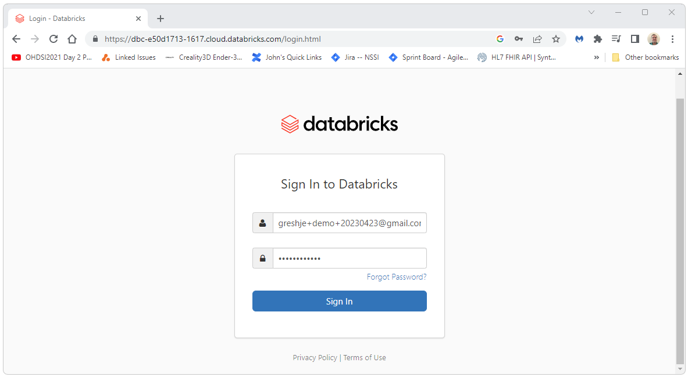

  <h1>Create a New Databricks Instance</h1>
  Databricks provides a 14 day trial version of Databricks. 
  This free version will require a host such as AWS, Azure, or Google Cloud. 
  This documentation uses AWS but should be vaild for the most part for Azure and Google Cloud. 
  This document will walk you through the steps to create a new free 14 day trial version of Databricks. 
    
  
  To get started creating your new Databricks instance go to 
  <a href="https://www.databricks.com/try-databricks">
    https://www.databricks.com/try-databricks
  </a> and follow the steps presented there. 
  These steps are detailed below.
    
  
  
    
  For this demo, we will be using Amazon.  Select Amazon as the provider in this step.
   
  

    
  After this initial registration, you should get an email.  Click on the link in the email to continue the registration process.
   
  
    
  Set the password.
   
  
    
  Select a plan (in this case we are selecting the default)
  
    
  Press the get started button.
  
    
  Press the Confirm button
  
    
  Give your workspace a name and select a region.
  
    
  You will then be propted to launch your AWS instance in order to set up the AWS side of things.
   
  
    
  AWS will then guide you through the AWS set up.
   
  
    
  Enter the email you used to create the Databricks instance and the password for that account.   
  
    
  Select "Create Stack".
   
  
    
  The stack will take a few minutes to create. During this time you will se a "CREATE_IN_PROGRESS" message.  
  
    
  While the AWS stack is being created, Databricks will indicate that the server is in a "Provisioning" state.  
  
    
  When the AWS stack is finished building, Databricks will indicate that the server is running.  
  
    
  At this point, you should receive an email from Databricks with a link to your new Databricks instance.
  
    
  You can now click on the link and sign in to your new Databricks test instance.
  
    
  Huzzah!
  
    
  For next steps (creating a token, getting your JDBC connection string, and connecting through JDBC) please see the 
  <a href="developer-how-tos_databricks-token.html">Create a Databricks Token</a> and the 
  <a href="developer-how-tos_databricks-jdbc.html">Getting Started with JDBC</a> pages. 

