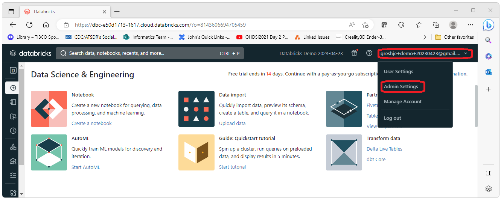
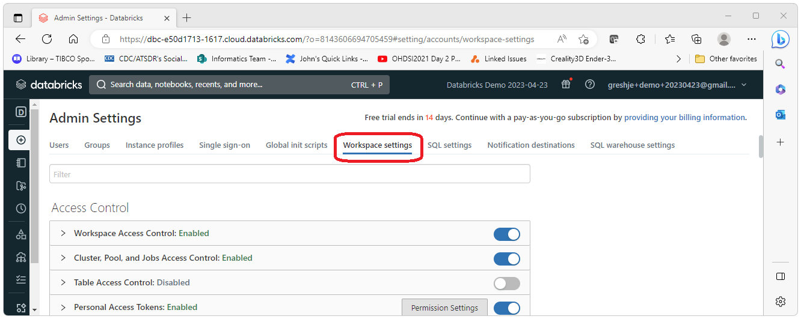
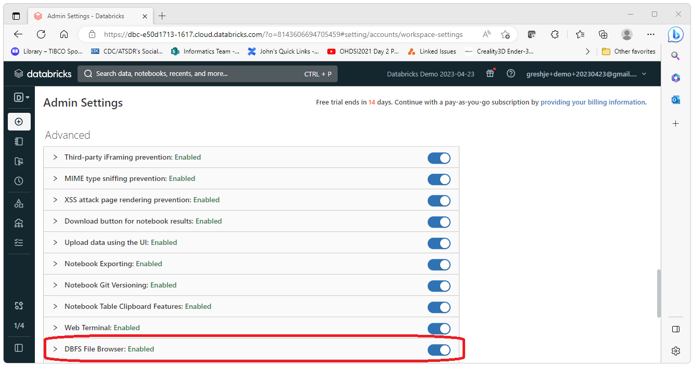
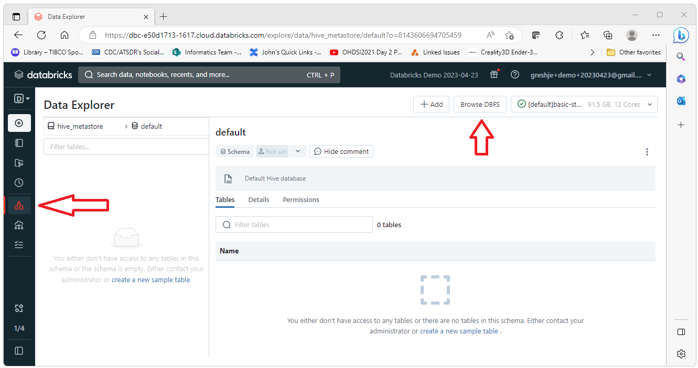

  By default, Databricks does not enable file browsing. 
  We will want to browse the files we upload to make sure we've uploaded what we think we've uploaded. 
  This guide shows how to enable file browsing. 
   
   
  To get started, log into Databricks and select the drop down for your user name in the upper right corner and then select Admin Settings.
   
  
    
  Select Workspace Settings
   
  
    
  Turn on the switch for DBFS File Browser: Enabled
   
  
    
  You should now see a DBFS button at the top of the Data page when you select the Data tab on the left side tabs.
   
  
    

