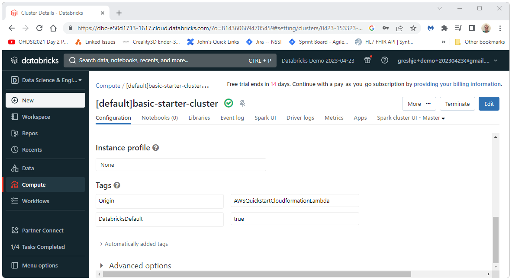
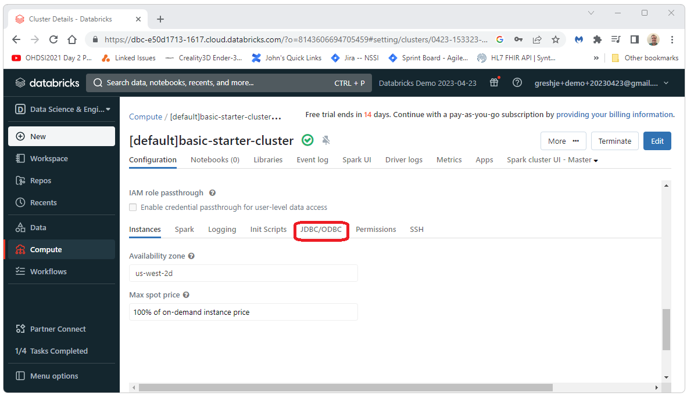

  The Broadsea distribution and other OHDSI software use JDBC connection strings to connect to the CDM. 
  This document shows how to get started with JDBC and Databricks. 
   
   
  First, we're going to need a JDBC connection string. 
  Start by loging into Databricks and select the Compute tab on the left side of the screen.
   
  
    
  Select Advanced Options at the bottom of the page.
   
  
    
  Select the JDBC/ODBC tab.
  
    
  Copy and save the JDBC URL.
  
    
  We can now use this url and the token generated in the <a href="developer-how-tos_databricks-token.html">Create a Databricks Token</a> section to create a complete valid JDBC url by replacing &lt;personal-access-token&gt; with that token. The complete url for the demo instance created here is shown below.
   
   
  jdbc:spark://dbc-e50d1713-1617.cloud.databricks.com:443/default;transportMode=http;ssl=1;httpPath=sql/protocolv1/o/8143606694705459/0423-153323-uwnabn2j;AuthMech=3;UID=token;PWD=dapi9fb7efRedactedMiddleOfTheToken2c1

