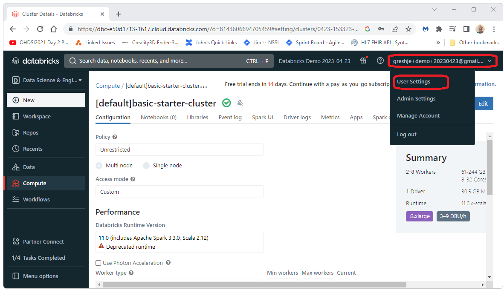
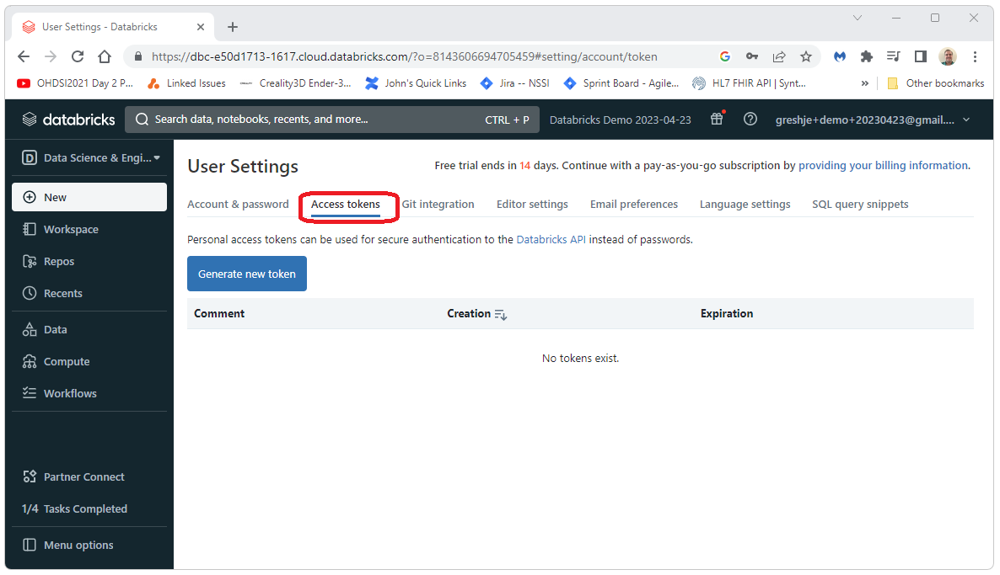
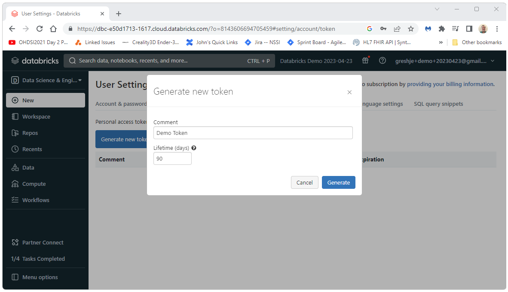

  Databricks uses tokens as a mechanism for authentication. 
  You'll need a token if you plan on connecting to Databricks using JDBC. 
  This document shows how to generate a token for Databricks. 
   
   
  Start by loging into Databricks and select the Compute tab on the left side of the screen. 
   
  
    
  Select the drop down for your user name in the upper right corner of the screen. Then select User Settings.
  
    
  Select the Access tokens tab. 
  
    
  Give the token a name and select Generate.
  
    
  Copy the token and save it in a safe place.
  
    
  You now have a token you can use to authenticate to Databricks. 
  For next steps see:
   
  <a href="developer-how-tos_databricks-jdbc.html">Getting Started with JDBC</a>

