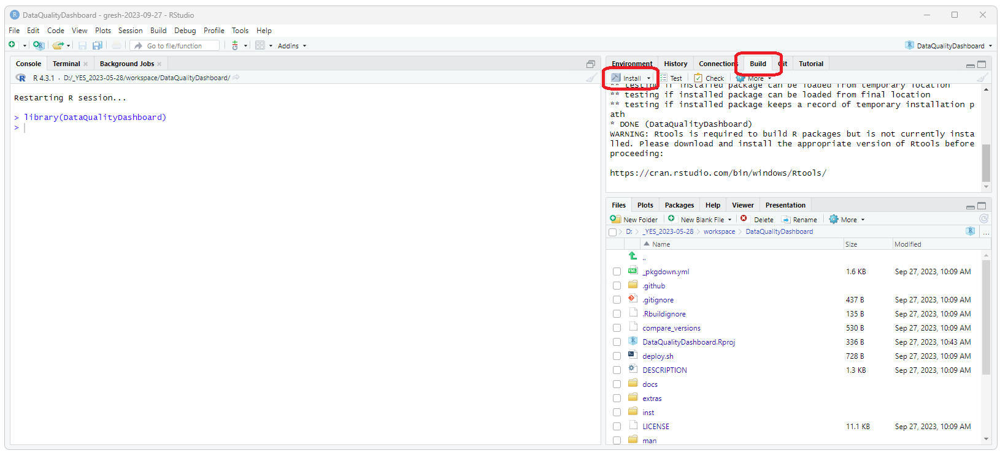
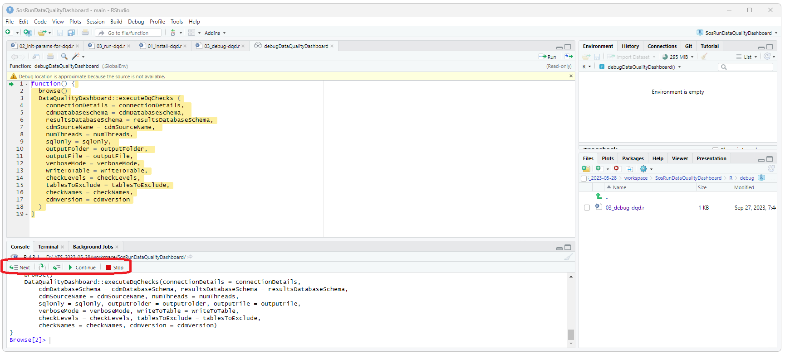
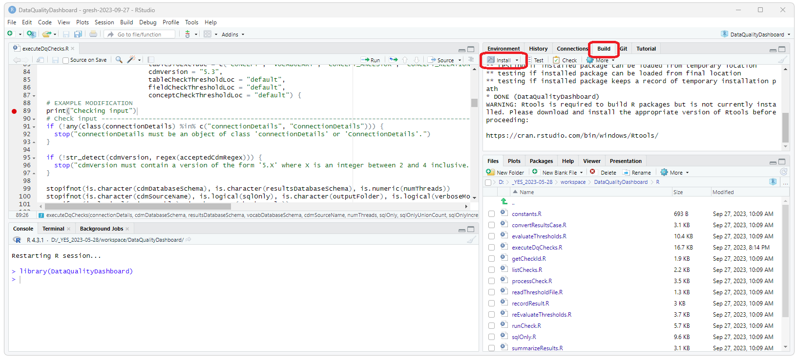

<!--
*
* Introduction
*
-->
<h3>Introduction</h3>
This document provides a complete example of how to 
<ul>
  <li>Download, install, and run Broadsea (including the Eunomia test CDM)</li>
  <li>Fork, create a branch, clone, and check out the Data Quality Dashboard from GitHub</li>
  <li>Install your local copy of the Data Quality Dashboard as the DataQualityDashboard R-Library</li>
  <li>Use the SosRunDataQualityDashboard project to configure, run, and debug Data Quality Dashboard</li>
</ul>

<!--
*
* Broadsea
*
-->
<h3>Broadsea</h3>

  Broadsea is a complete solution for running OHDSI tools that runs in a 
  <a href="https://www.docker.com/">Docker</a> container. 
  Complete instructions for installing and running Broadsea are here: 
  <a href="developer-how-tos_gen_dev_broadsea.html">Install and Run Broadsea</a>

<!--
*
* Download SosRunDataqualityDashbosard
*
-->
<h3>Download and Initialize the SosRunDataQualityDashboard project</h3>

  The SosRunDataQualityDashboard provides some simple scripts that can be used to: 
  <ul>
    <li>Install the R libraries required for DQD</li>
    <li>Create the configuration to run DQD</li>
    <li>Run DQD</li>
    <li>View the results of DQD</li>
  </ul>
  

  Clone the SosRunDataQualityDashboard using the following:
<pre class="pre-scrollable">
git clone https://github.com/NACHC-CAD/SosRunDataQualityDashboard
</pre>  
  Open ./SosRunDataQualityDashboard/SosRunDataQualityDashboard.Rproj 
  and then open and run 01_install-dqd.r. 
  This will install the packages and libraries required for DQD. 
  When asked to restart R select "No". 
  When asked "Which would you like to update?" enter 1 (for all). 
  

  

<!--
*
* Download DQD
*
-->
<h3>Download and Install the Data Quality Dashboard project</h3>

  Clone the DataQualityDashboard using the following:
<pre class="pre-scrollable">
git clone https://github.com/OHDSI/DataQualityDashboard
</pre>  
  Open ./DataQualityDashboard/DataQualityDashboard.Rproj in RStudio. 
  In the upper right hand corner, select the build tab and then select the Install button. 
  This will install your local copy of the DQD code as the package and library for R. 
   
  

<!--
*
* Debug DQD
*
-->
<h3>Run/Debug DQD</h3>

  Go back to the SosRunDataQualityDashboard project. 
  Edit and run the 02_init-params-for-dqd.r script. 
  You should now be able to run DQD by running the 03_run-dqd.r script. 
  You should be able to debug DQD by running the ./debug/03_debug-dqd.r script. 
  When you run this script, RStudio will stop at the browse() statement. 
  You can then use the navigation buttons towards the bottom of the screen 
  (at the top of the Console pain) to 
  <ul>
    <li>Run the current line of code (step over)</li>
    <li>Step in to the next function</li>
    <li>Continue: run to the end of the current function</li>
    <li>Stop: stop running the script</li>
  </ul>
  
   
   
  You can now get into and debug the source code for DQD by doing the following:
  <ul>
    <li>Selecting "Step into" ONCE should bring you to the "browse()" line.</li>
    <li>Selecting "Step over" TWICE should bring you to the "DataQualityDashboard::executeDqChecks" line</li>
    <li>Selecting "Step into" ONCE should drop you into the source code for DataQualityDashboard::executeDqChecks</li>
  </ul>
  You can then set a break point by single clicking in the space to the left of the line numbers. 
  You might need to set the break point in the DQD code, stop the script, and then restart the script and select "Continue" when you hit the "browser()" line. 
  You can then run to that break point by selecting "Continue". You can do this for as many breakpoints as you like. 
   
  

<!--
*
* Edit and run modified code
*
-->
<h3>Edit and Run Modified DQD Code</h3>

  We can now edit the DQD code and then run the modified code. 
  

    IMPORTANT: After editing the code, you will need to rerun the install as described above and shown in the image below. 
  

  

    IMPORTANT: Before rerunning the debug code, you need to restart the R session to pick up the modified DQD code. 
  

  
   
   
  Rerunning the debug script should now execute the modified code. Again, you might need to step into the DQD code, 
  set the break point, and then rerun the debug code. 
  

