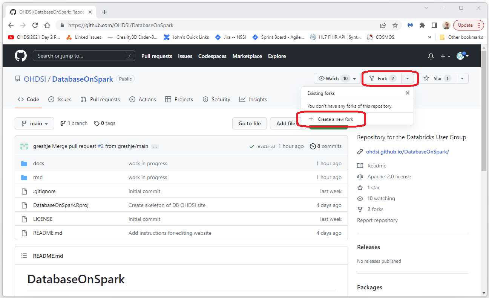

			<h1>Git and Github Quickstart Guide</h1>
			This is the quick start guid for Git and Git hub.  
			Git is a version control system that is used by virtually all open source (and other large) projects.  
			This quick start guide shows how to download and install a Git client, 
			how to create a Github account,
			and how to get permissions for an existing Github project (like this one!).   

			<h2>Summary</h2>
			The following steps are detail below.  
			<ul>
				<li>Install a Git Client</li>
				<li>Create a Github Account</li>
				<li>Fork a Project</li>
				<li>Clone the Project</li>
				<li>Make Your Updates</li>
				<li>Commit Your Updates</li>
				<li>Create a Pull Request</li>
			</ul>

      <!-- 
      *
      * install a client
      *
      * -->

			<h2>Install a Git Client</h2>
			Instructions for installing a Git client are 
			<a target="gitclient" href = "./developer-how-tos-install-git-client.html">
				here
			</a>. 
			 
			
      <!-- 
      *
      * create an account
      *
      * -->

			<h2>Create a Github Account</h2>
			Go to <a href="https://github.com/">https://github.com/</a> and select "Sign Up".  
			Follow the instructions there to create your Github account.  
			
			  
			

				Once you've created your account you can check your user name by selecting the icon in the upper right corner 
				and then selecting "Your Profile" (select the link at the bottom of the screen to skip the tutorial first).  
				Your user name should be on the left side of the screen.  
			

      <!-- 
      *
      * fork a project
      *
      * -->

			<h2>Fork the Project</h2>
			Login to Github with the account you would like to use for this work. 
      Navigate to the project you want to edit, in this case 
      [https://github.com/OHDSI/DatabaseOnSpark](https://github.com/OHDSI/DatabaseOnSpark). 
      Select the "Fork" drop down and then select "Create a new fork" as shown below. 
       
      

      <!-- 
      *
      * clone
      *
      * -->

			<h2>Clone the Repository</h2>
			

  			"Cloning" the repository just means pulling a copy of the files down to your local machine in a way that 
  			any changes you make can be merged back into the repository.  
			

			

				Open a cmd prompt and navigate to the directory where you would like the project to live.  
			

			

				After you've install the client you will need to issue the following two commands (this is usually a one time thing).  
				 
				git config --global user.email "the-email-you-registered-withc@yourhost.com"
				 
				git config --global user.name "YOUR_USERNAME"
			

			

				To clone the repository, enter the command: 
				git clone &lt;paste-repository-name-here&gt;
			

			
			
			 
			<h2>Make Your Updates and Commit</h2>
			Change to the directory that was downloaded from the clone process.  
			Make your updates to the files.  
			When you are done with your updates, commit the changes using the following Git commands. 
			 
			 
			git add -A  
			git commit -m "a very useful and meaningful message"  
			git push origin  

  <h3>Configuring Security</h3>
  

    The first time you try to push your updates you will be asked for a username and a password. 
    Your username/password will not work as github has moved to only allowing token based authentication for this activity. 
    To get a token follow the [Create Token](developer-how-tos_git-create-token.html) instructions. 
    Then use your username for the username and the token for the password. 
    Note that pasting the token in as the password can be a little tricky as the cmd prompt does not change when you do the paste. 
    I find the best way to do this is to click the top border of the cmd window to set the focus to that window. 
    Then, right click in the window (this does the paste). 
    Then, press enter. 
  

