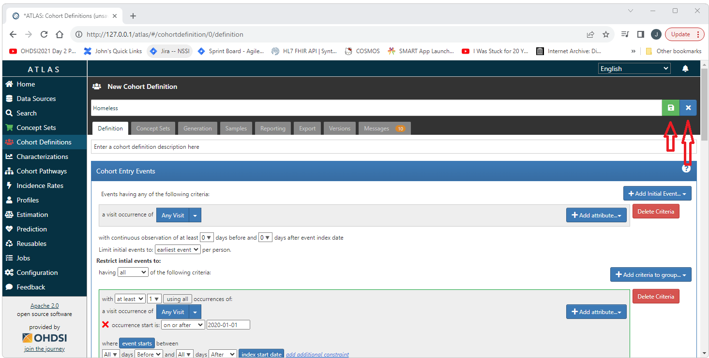
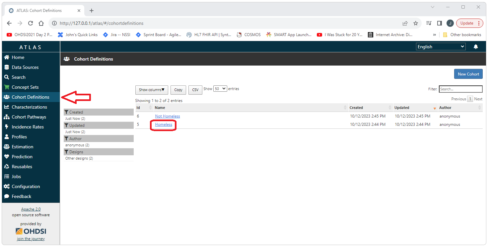
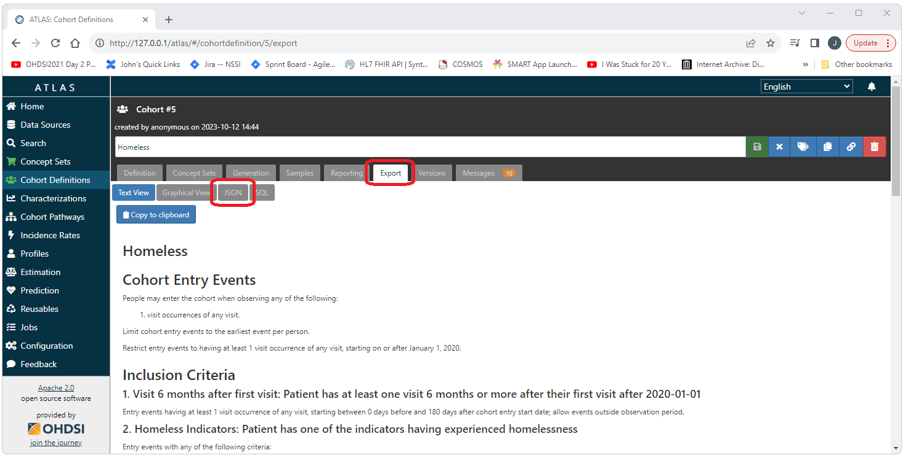
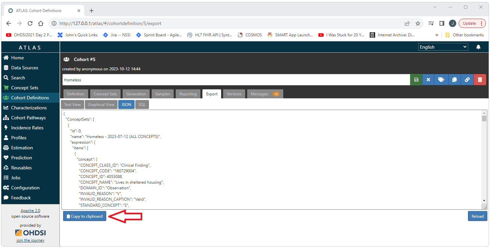

<!--
*
* HOW TO: Import and Export Cohorts
*
--> 

---
title: '
How to Import and Export Cohort Definitions in Atlas
'
output:
  html_document:
    toc: FALSE
    toc_depth: 3
    toc_float:
    collapsed: false
---

<!--
*
* Introduction
*
-->
<h3>Introduction</h3>
This document provides a complete example of how to import and export a cohort in Atlas. 

<!--
*
* Import
*
-->
<h2>Importing Cohorts</h2>
This section will cover how to import a cohort from a json file representation of that cohort. 

<!--
*
* Source Files
*
-->
<h3>Source Files</h3>
We will be using the following two source files for this example. 
Download these files to the machine you will be using to access Atlas. 

  <a href="./img/imp-dev/cohort/homeless-past-6-months-cohort.json" download>homeless-past-6-months-cohort.json</a>
   
  <a href="./img/imp-dev/cohort/not-homeless-past-6-months-cohort.json" download>not-homeless-past-6-months-cohort.json</a>

  Open Atlas and navigate to the Cohort Definitions tab on the left side menu. 
  Select the New Cohort button in the upper right section of the screen. 
   
  
   
   
  Enter a name for the cohort. 
  Select the Export tab (Yes, not a typo, we select the Export tab to Import)
   
  
   
   
  Under the Eport tab, select the JSON tab. 
  Paste the contents of the json file (in this case, homeless-past-6-months-cohort.json) in the text area. 
  Select the reload button in the bottom right of the screen. 
  Selecting the Definition tab will take us back to the definition of the cohort. 
   
  
   
   
  If we scroll down a little bit on the Definition tab, we can see that the cohort has indeed been imported. 
   
  
   
   
  Scroll back to the top of the Definition tab. 
  Select the save icon (green button in the upper right corner of the screen). 
  Select the close button (x) to return to the list of existing cohort definitions. 
   
  
   
   
  We should now see the cohort definition we just imported in the list. 
   
  
   
   
  We can now repeat the process for the not-homeless-past-6-months-cohort.json file. 
  After importing the not-homeless-past-6-months-cohort.json file 
  both cohorts will appear on the main cohorts page. 
   
  
   
   

  <!--
  *
  * Export
  *
  -->
  <h2>Exporting Cohorts</h2>
  

    This section will cover how to export a cohort to a json file representation of that cohort. 
  

  

    Select the Cohort Definitions tab from the left hand menu. 
    Select the Cohort to be exported. 
     
    
     
     
    Select the export tab. 
     
    
     
     
    On the Export tab, select the JSON tab. 
     
    
     
     
    Select the copy to clipboard button to copy the contents of the json representation of the cohort to the clip board. 
    Paste the copied content into a text file. 
     
    
     
     
  

