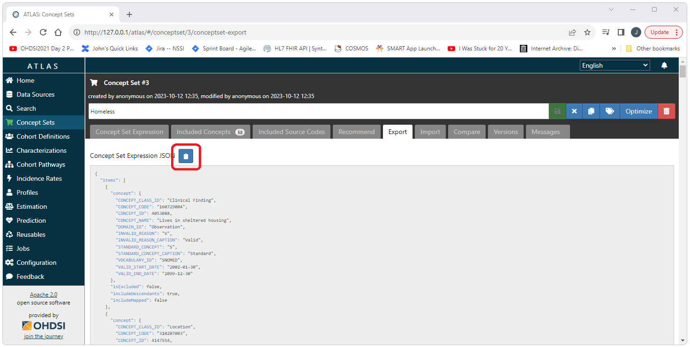

<!--
*
* HOW TO: Import and Export Concept Sets
*
--> 

---
title: '
How to Import and Export Concept Sets in Atlas
'
output:
  html_document:
    toc: FALSE
    toc_depth: 3
    toc_float:
    collapsed: false
---

<!--
*
* Introduction
*
-->
<h3>Introduction</h3>
This document provides a complete example of how to import and export a value set in Atlas. 

<!--
*
* Import
*
-->
<h2>Importing Concept Sets</h2>
This section will cover how to import a concept set from a json file representation of that concept set. 

<!--
*
* Source Files
*
-->
<h3>Source Files</h3>
We will be using the following two source files for this example. 
Download these files to the machine you will be using to access Atlas. 

  <a href="./img/imp-dev/value-set-cohort/homeless-concept-set.json" download>homeless-concept-set.json</a>
   
  <a href="./img/imp-dev/value-set-cohort/not-homeless-concept-set.json" download>not-homeless-concept-set.json</a>

  Open Atlas and navigate to the Concept Sets tab on the left side menu. 
   
  
   
   
  Enter a name for the concept set and select the Import tab. 
   
  
   
   
  Under the Import tab, select the Concept Set tab. 
  Paste the contents of the source file (for this example, the homeless-concept-set.json file). 
  Select the Overwrite Concept Set Expression button in the lower right corner of the screen. 
  Select the Concept Set Expression tab to view the results of the import. 
   
  
   
   
  On the Concept Set Expression tab, select the green save icon in upper right corner. 
  Selecting the blue close (x) button will return you to the Concept Set home page (the list of existing concept sets). 
   
  
   
   
  The new concept set will now appear on this page. 
  We can now repete the process for the not-homeless-concept-set.json file. 
   
  
   
   
  After importing the not-homeless-concept-set file both concept sets will appear on the main concept sets page. 
   
  
   
   

  <!--
  *
  * Export
  *
  -->
  <h2>Exporting Concept Sets</h2>
  

    This section will cover how to export a concept set to a json file representation of that concept set. 
  

  

    Select the Concept Sets tab from the left hand menu. 
    Select the Concept Set to be exported. 
     
    
     
     
    Select the export tab.
     
    
     
     
    Select the clipboard icon to copy the contents of the json representation of the concept set to the clip board. 
    Paste the copied content into a text file. 
     
    
     
     
  

