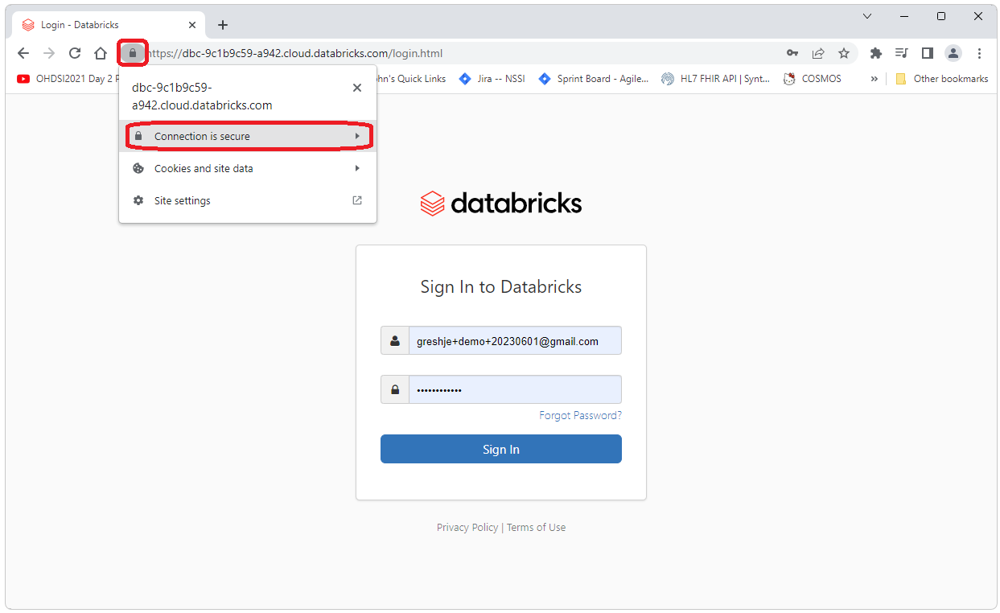
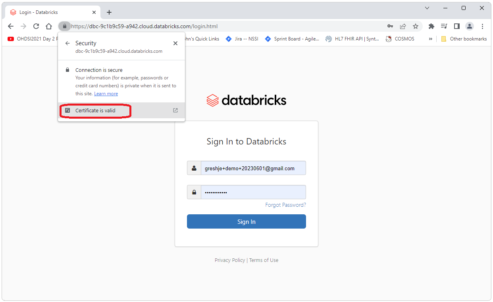
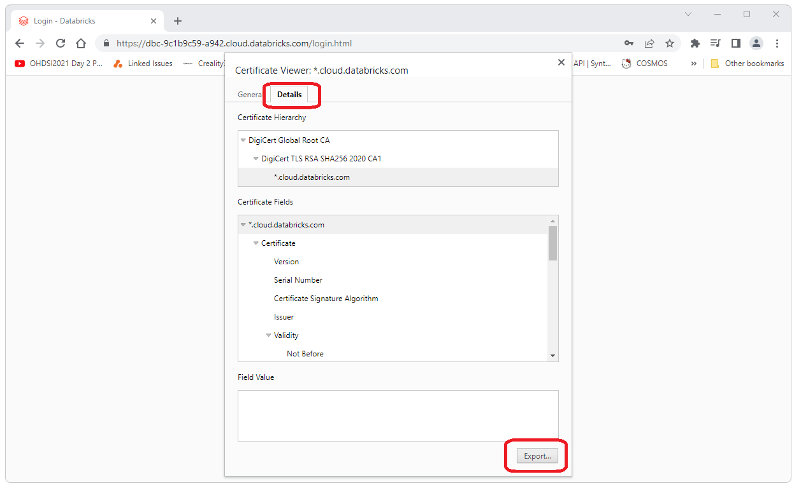
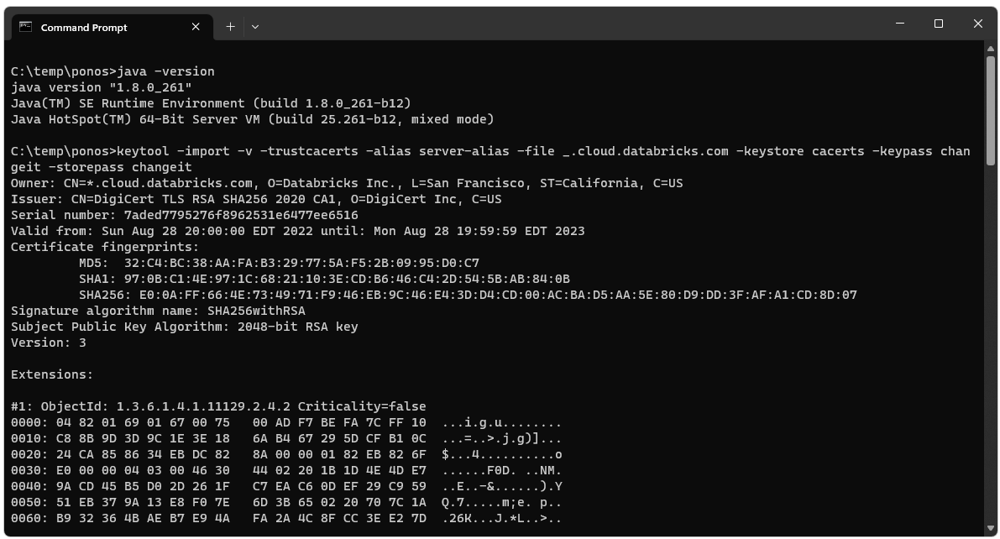

  <h2>Introduction</h2>
  There are two configuration issues to be aware of when running OHDSI on Databricks. 
  <ol>
    <li>
      <b>Paramterization of Token:</b>
       
      This process uses a parameterized Token (i.e. the token is not included in the URL but is only added in at the point where it is needed for security reasons). 
      URLs used here should end with PWD= (i.e. not PWD=myToken). 
    </li>
    <li>
      <b>UseNativeQuery:</b>
       
      The "UseNativeQuery=1;" parameter needs to be added to the JDBC URL that is written to the webapi.source table. 
      This is required for all instances of OHDSI on Databricks 
      (i.e. this is required for both native Tomcat installations as well as Broadsea implementations). 
    </li>
    <li>
      <b>SocketTimeout:</b>
       
      Some of the scripts required to get the OHDSI stack up and running take more time that the default timeout for a JDBC connection to Databricks. 
      This issue can be resolved by adding the parameter "SocketTimeout" to the url use to run the scripts as shown below.  
    </li>
    <li>
      <b>SSL Configuration for Broadsea:</b>
       
      Broadsea requires some manual configuration to enable the SSL connection that is used by Databricks by default. 
      Configuring Broadsea for SSL connections is described here. 
    </li>
  </ol>
  <!-- 
  *
  * USE NATIVE QUERY
  *
  -->
  <h2>UseNativeQuery</h2>
  The "UseNativeQuery=1;" parameter is set automatically by the Ponos install. 
  To confirm this you can open pgAdmin and check the records created in the webapi.source table. 
  If you are manually creating the webapi.source record, please note the following: 
   
   
  A Databricks JDBC URL provided by Databricks usually looks something like this:
<pre class="pre-scrollable">
jdbc:spark://dbc-9c1b9c59-a942.cloud.databricks.com:443/default;transportMode=http;ssl=1;httpPath=sql/protocolv1/o/2010859959023967/0602-003109-756w8ulw;AuthMech=3;UID=token;PWD=
</pre>
This URL needs to be modified by adding the "UseNativeQuery=1;" parameter to look like the following.
<pre class="pre-scrollable">
jdbc:spark://dbc-9c1b9c59-a942.cloud.databricks.com:443/default;transportMode=http;ssl=1;httpPath=sql/protocolv1/o/2010859959023967/0602-003109-756w8ulw;AuthMech=3;UseNativeQuery=1;UID=token;PWD=
</pre>
  <!-- 
  *
  * SOCKET TIMEOUT
  *
  -->
  <h2>SocketTimeout</h2>
  When you set the JDBC URL in the paramters file to run Ponos, include a SocketTimeout setting as shown below (we're using 60 minutes here). 
<pre class="pre-scrollable">
jdbc:spark://dbc-9c1b9c59-a942.cloud.databricks.com:443/default;transportMode=http;ssl=1;httpPath=sql/protocolv1/o/2010859959023967/0602-003109-756w8ulw;AuthMech=3;UseNativeQuery=1;SocketTimeout=3600;UID=token;PWD=
</pre>
  <!-- 
  *
  * CONFIGURE SSL
  *
  -->
  <h2>Configure SSL</h2>
  A vaild cacerts file is required for Broadsea to work with Databricks. 
  A valid cacerts file for your Databricks JDBC URL can be created according to the following. 
  <h3>Get The Certificate</h3>
  Navigate to your Databricks instance from Chrome (or other browser of your choice, the instructions below are for Chrome, other browsers will vary in how the information is accessed). 
  Use the location portion of your JDBC URL to find the page. 
  The URL should look something like what is shown below. 
  Be sure to use https. 
<pre class="pre-scrollable">
https://dbc-9c1b9c59-a942.cloud.databricks.com/login.html
</pre>
   
  Click on the lock icon to the left of the URL and select "Connection is Secutre"
   
  
    
  Select the "Certificate is valid" link. 
   
  
    
  Select the "Details" tab and the select "Export".
   
  
    
  This will download the certificat you will need. 
   
  
    
  <h3>Create the cacerts File</h3>
  Navigate to the directory of the certificate file you just downloaded. 
  Run java -version to confirm you are using Java 8 (cacerts file needs to be created with Java 8). 
  Then execute the following cmd (you'll probably need to change the file name and can change the password etc.). 
<pre class="pre-scrollable">
java -version
keytool -import -v -trustcacerts -alias server-alias -file _.cloud.databricks.com -keystore cacerts -keypass changeit -storepass changeit
</pre>
  Output from the cmd should look similar to the following. 
   
  
    
  After running the cmd there should be a cacerts file in the directory where you ran the cmd. 
   
  
    
  <h3>Deploy cacerts to Broadsea</h3>
  Copy and paste this new file in the root directory of Broadsea (replacing the existing blank cacerts file). 
   
  
    
  <h3>Restart Broadsea</h3>
  Open a cmd window, navigate to the Broadsea directory and restart Broadsea. 
<pre class="prescrollable">
docker compose --profile default down 
docker compose pull && docker-compose --profile default up -d
</pre> 
   
  Open <a href="http://127.0.0.1/atlas">http://127.0.0.1/atlas</a> in a browser and navigate to Data Sources. 
  Select your data source (in this case "Databricks Demo" and then select a report, the Person report is shown in the screen shot below). 
  When you do this you should not see any errors in the Docker output for webapi as shown below. 
   
  
   
   
  

