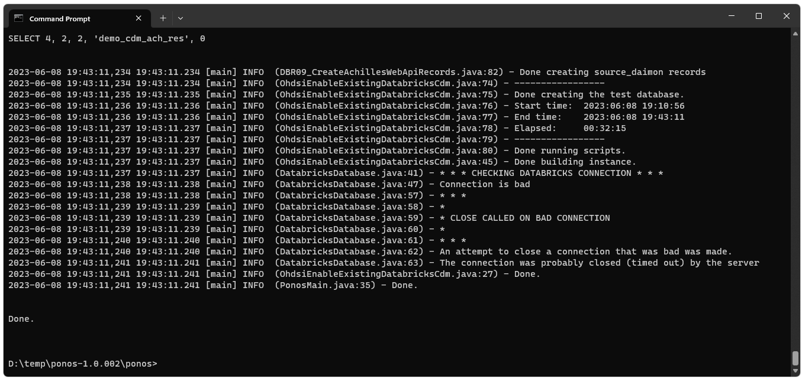
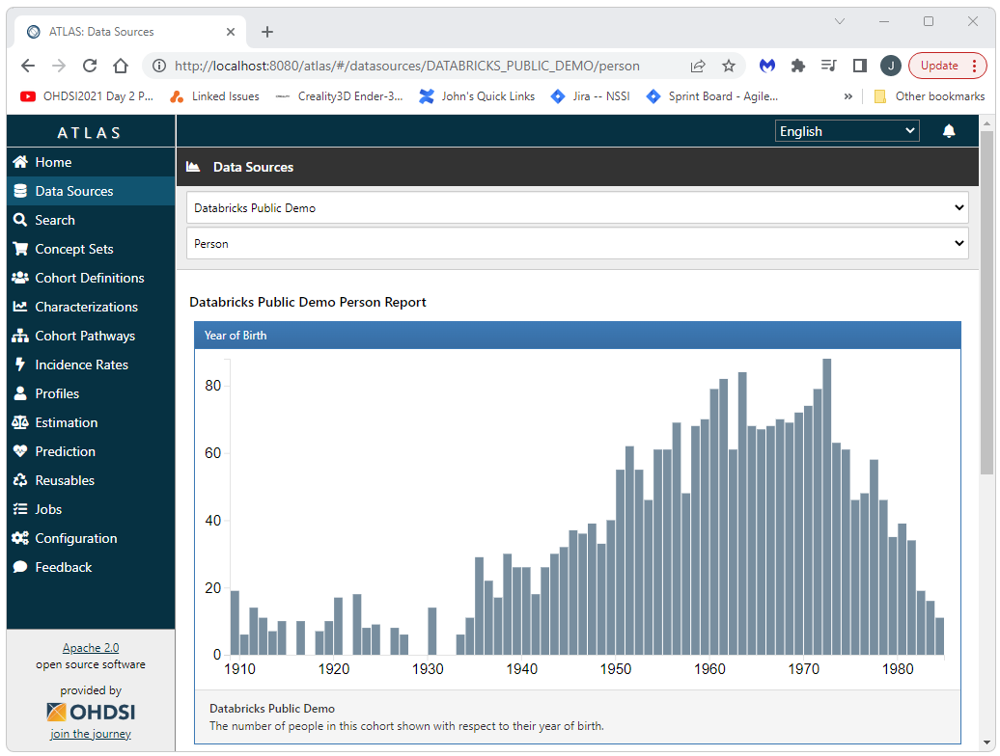

  <h2>Introduction</h2>
  This quick start guide gives the basics for how to create a test (demo_cdm) instnace of the CDM in Databricks 
  and then how to get an existing CDM in Databricks connected to OHDSI. 
  This guide is for a standalone Tomcat instance (i.e. not Broadsea). 
  Ponos can also be used with Broadsea. 
  See the 
  <a href="./developer-how-tos_broadsea.html">Broadsea Implementation Guide</a> 
  for guidance on setting up a Databricks CDM with Broadsea. 
  <h2>Download and Install Ponos</h2>
  Ponos is a tool that can be used to automate most of the processes required to get an instance of a CDM ready for OHDSI use. 
  Detailed instructions for downloading and installing Ponos can be found on the 
  <a href="./developer-how-tos_ohdsi-on-databricks_ponos-install.html">Ponos Install</a> page.  

  <h2>Create an Instance of the DEMO_DB CDM in Databricks</h2>
  To create an instance of the DEMO_DB CDM in Databricks, simply execute run-ponos.bat with the db-demo parameter as shown below:
<pre class="pre-scroll">
run-ponos.bat db-demo
</pre>
   
  This will create a complete instance of the DEMO_DB instance in your Databricks instance as shown below. 
  You can then use this instance as your CDM. When the process has completed, you should see something similar to the following 
  (note that the process took about 6 min):
   
  
   
   
  You should then be able to open a notebook in Databricks and query the new instance to confirm it was created. 
   
  
   
   

  <h2>Connect an Existing Databricks CDM to OHDSI</h2>
  To connect an existing CDM to OHDSI simply execute run-ponos.bat with the db-init parameter as shown below:
<pre class="pre-scrollable">
run-ponos.bat db-init
</pre>
  This will execute all of the steps required to make your Databricks CDM available to OHDSI.
  When this process has completed, you should see output similar to the following:
   
  
   
   
  <h3>Install the Required Software for Atlas Running on Standalone Tomcat</h3>
  Detailed istructions for installing and configuring all of the software required to run Atlas as a standalone application 
  (i.e. not in a Docker container using Broadsea) 
  are available at 
  <a href="https://nachc-cad.github.io/fhir-to-omop/pages/navbar/how-tos/developer-how-tos/install-eclipse-yes/InstallEclipseYes.html">https://nachc-cad.github.io/fhir-to-omop/pages/navbar/how-tos/developer-how-tos/install-eclipse-yes/InstallEclipseYes.html</a>
  <h3>Inatall, Configure, and Run Atlas</h3>
  Detailed instructions for installing and configuring Atlas as a standalone Tomcat application can be found at 
  <a href="https://nachc-cad.github.io/fhir-to-omop/pages/navbar/ohdsi-tools/atlas/Atlas.html">https://nachc-cad.github.io/fhir-to-omop/pages/navbar/ohdsi-tools/atlas/Atlas.html</a>
  <h3>Start Tomcat and Navigate to Atlas</h3>
  You should then be able to start Tomacat and see your Databricks CDM instance in Atlas. 
  Start Tomcat, open a browser, and navigate to: 
<pre class="pre-scrollable">
http://localhost:8080/atlas
</pre>
   
  When you navigate to the Datasources tab and select the People report, you should see something similar to the following 
  (this image shows data from the DEMO_CDM database).  
  
  
  
  
  
     
     

