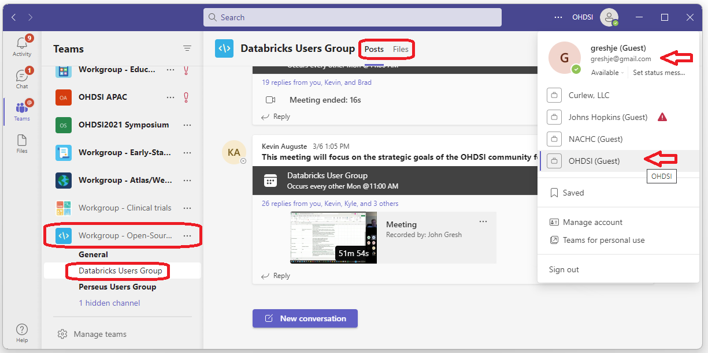

<h2>MS Teams Resources</h2>

Below are links to our main Microsoft Teams resources. 
Before you can access the Databricks User Group Teams resources you'll need to sign up for the group. 
To join the OHDSI Databricks User Group sign up using the 
<a href="https://forms.office.com/Pages/ResponsePage.aspx?id=lAAPoyCRq0q6TOVQkCOy1ZyG6Ud_r2tKuS0HcGnqiQZUOVJFUzBFWE1aSVlLN0ozR01MUVQ4T0RGNyQlQCN0PWcu">OHDSI Workgroups Sign Up page</a>. 
Sign up for the Open Source Community (the Databricks User Group is a subgroup of the Open Source Community). 

 
When you launch MS Teams, you should see a list of the groups you are signed up for. 
If you do not see the list of groups you expected, check that you are using the email you signed up with 
and that you are in the correct OHDSI host (see red arrows in the image below). 
The Databricks Users Group is a sub-group of the Open Source work group (see red ovals on the left in the image below). 

 
<table claSS="table">

  <tr>
    <td>Databricks User Group</td>
    <td>
      <a href="https://teams.microsoft.com/l/channel/19%3a54e0717f78fb428ea842ca1d5fec53dc%40thread.tacv2/Databricks%2520Users%2520Group?groupId=3c4549e9-9de8-4827-9813-e751120326ad&tenantId=a30f0094-9120-4aab-ba4c-e5509023b2d5">Databricks User Group</a>
       
      This is the main MS Teams Channel for the Databricks User Group.  
    </td>
  </tr>

  <tr>
    <td>Objectives and Key Results (2023)</td>
    <td>
      <a href="https://ohdsiorg.sharepoint.com/:f:/r/sites/Workgroup-Open-SourceCommunity/Shared%20Documents/Databricks%20Users%20Group/OKR-2023?csf=1&web=1&e=avdr2R">Objectives and Key Results</a>
       
      This is where our Objectives and Key Results (OKR) document can be found.
    </td>
  </tr>

  <tr>
    <td>Recordings</td>
    <td>
      <a href="https://ohdsiorg.sharepoint.com/:f:/r/sites/Workgroup-Open-SourceCommunity/Shared%20Documents/Databricks%20Users%20Group/Recordings?csf=1&web=1&e=n9KDfM">Recordings</a>
       
      This is where recordings of previous meetings can be found in MS Teams.
    </td>
  </tr>

</table>

